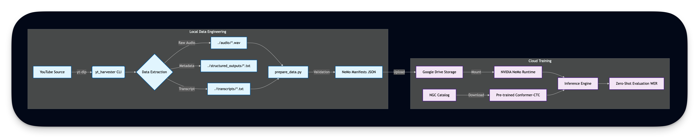

# Vietnamese ASR Pipeline with NVIDIA NeMo

[](https://github.com/NVIDIA/NeMo)
[](https://colab.research.google.com/github/wheevu/nemo-vietnamese-asr/blob/main/NVIDIA_NeMo_ASR.ipynb)
[](https://www.python.org/)
[](https://github.com/wheevu/nemo-vietnamese-asr/actions/workflows/run_tests.yml)

## 1. Overview

I designed this project to build a complete pipeline for creating a Vietnamese speech-to-text dataset and training models using **NVIDIA NeMo**. It downloads raw audio from YouTube, cleans it, and prepares it for high-performance GPU training.

I followed **NVIDIA’s production philosophy**: Training and Serving are two different processes.
*   **This Repo (Training):** Focuses on creating the dataset and building the model artifact.
*   **Future Scope (Serving):** Running the model in an API (like NVIDIA Riva) is a separate step not covered here.

This separation follows the architecture defined in **[NVIDIA’s NIM Microservices coursework](https://learn.nvidia.com/courses/course-detail?course_id=course-v1:DLI+S-FX-23+V1).**

## 2. How It Works

 This project has a **Local-to-Cloud** workflow. This allows development on a standard laptop (Mac/Windows) while only paying for cloud GPUs when actual training is required.



1.  **Local Data Prep (CPU):** Doing the "Heavy Lifting" of downloading and processing audio locally.
2.  **Cloud Training (GPU):** Uploading the clean data to Google Colab to run the actual NeMo training.
3.  **Strict Validation:** Prioritizing manual transcripts over auto-generated ones to make sure the model learns from high-quality data.

### Scope & Non-Goals
*   **Goal:** Build a clean dataset and a training pipeline.
*   **Non-Goal:** No live API endpoint or a web app here.
*   **Constraint:** Designed to prevent "Out of Memory" (OOM) errors on T4 GPUs by chopping audio into 30-second chunks.

## 3. Project Structure

```bash
nemo-vietnamese-asr/
├── src/
│   └── yt_harvester/           # The Tool: Downloads & Cleans Data
│       ├── __main__.py         # Entry point
│       ├── downloader.py       # Logic to fetch YouTube video/audio
│       └── processor.py        # Logic to analyze text (sentiment)
├── audio/                      # Output: Clean 16kHz WAV files
├── transcripts/                # Output: Clean text files
├── prepare_data.py             # Script: Generates NeMo manifest files
├── benchmark.py                # Script: Tests model speed (FPS/WER)
├── NVIDIA_NeMo_ASR.ipynb       # Notebook: Run this in Google Colab
└── tests/                      # Quality Assurance (QA)
```

## 4. Step 1: Local Data Engineering

The tool inside `src/yt_harvester` (reused legacy code) turns messy YouTube links into a clean dataset.

### What it does
*   **Best Transcript First:** It looks for a human-written transcript. If none exists, it falls back to auto-generated captions.
*   **Audio Formatting:** It automatically converts audio to **16kHz Mono WAV**, which is the standard required by NeMo models.
*   **Smart Skipping:** If ran twice, it skips files already downloaded to save time.

### How to use it

```bash
# 1. Process a single video
python -m src.yt_harvester "https://www.youtube.com/watch?v=VIDEO_ID"

# 2. Process a list of videos
python -m src.yt_harvester --bulk links.txt --workers 4

# 3. Create the training files (Manifests)
python prepare_data.py --seed 42
```

### The Validation Layer (`prepare_data.py`)
Before sending data to the GPU, this script checks the work. It removes empty files, fixes text formatting (lowercase), and splits the data into Train/Test sets (80/10/10).

## 5. Step 2: Cloud Workflow (Google Colab)

Open `NVIDIA_NeMo_ASR.ipynb` in Google Colab to handle the GPU work.

### Workflow Logic
1.  **Load Data:** Unzips the dataset directly to the Colab disk for speed.
2.  **Load Model:** Downloads the `stt_en_conformer_ctc_large` model from NVIDIA.
3.  **Evaluate:** Runs the model on the Vietnamese data.
    *   *Note:* Since I am using an **English** model on **Vietnamese** audio without fine-tuning, the accuracy will be low (high WER). This proves the pipeline works before spending hours fine-tuning.

## 6. Results & Analysis

I performed a "Zero-shot" test (running the English model on Vietnamese audio).

*   **Result:** The model attempts to map Vietnamese sounds to English words phonetically.

| Original Vietnamese Audio | Model Transcription (English Phonetics) | Analysis |
| :--- | :--- | :--- |
| **"Giang Ơi Radio"** | _"the radio"_ | Recognized the English loanword |
| **"Chào bạn"** | _"ta bak"_ | Acoustic approximation (sounds similar) |

**Conclusion:** The pipeline successfully feeds audio to the model. The next logical step is **Transfer Learning**: freezing the model's "ear" (Encoder) and retraining its "brain" (Decoder) to understand Vietnamese text.

---

## Optimizing for Speed (Quantization)

To make the model run faster on smaller GPUs (like the free Colab T4), I use **Quantization** (following **[“Quantization Fundamentals with Hugging Face”](https://www.deeplearning.ai/short-courses/quantization-fundamentals-with-hugging-face/)**). This reduces the precision of the math inside the model (from 32-bit floating point to 16-bit) to save memory and increase speed.

### Benchmark Results (Colab T4 GPU)

I wrote `benchmark.py` to measure exactly how much faster the optimized model is.

| Precision | Speed (Latency) | VRAM Usage | Notes |
| :--- | :--- | :--- | :--- |
| **float32** (Standard) | 151 ms/file | ~731 MB | Baseline speed. |
| **float16** (Optimized) | **89 ms/file** | ~888 MB | **~40% Faster.** Recommended for T4. |
| **int8** | N/A | ~166 MB | Currently incompatible with this model type. |

To run this benchmark yourself in Colab:
```bash
python benchmark.py --model stt_en_conformer_ctc_large --manifest val_manifest.json
```

## 7. Testing & Quality Assurance

Bad data ruins training runs. I included a professional test suite to catch errors *before* they crash the training script. (following **["Testing Machine Learning Systems: Code, Data and Models" by Made With ML](https://madewithml.com/courses/mlops/testing/)**)

### What I test
*   **Text Processing:** Does the code handle YouTube URLs correctly? Does it preserve Vietnamese diacritics (accents)?
*   **Data Integrity:** Are the audio files actually 16kHz mono? Do the JSON manifests point to real files?

### How to run tests
```bash
# Run all tests
pytest tests/ -v
```

### Example Output
```text
tests/test_data_integrity.py::TestAudioFormatCompliance::test_audio_sample_rate_is_16khz PASSED
tests/test_text_processing.py::TestCleanCaptionLines::test_vietnamese_diacritics_preserved PASSED
```

## 8. Continuous Integration (CI)

I use **GitHub Actions** to automatically run these tests every time code is pushed. This ensures that a code change doesn't accidentally break the data processing pipeline.

**Pipeline:** Checkout Code -> Install Audio Libs -> Run `pytest`.

## Dependencies

*   **Local:** `yt-dlp` (Downloading), `ffmpeg` (Audio conversion), `textblob` (Analysis), `soundfile`.
*   **Cloud:** `nemo_toolkit[all]`, `pytorch-lightning`, `jiwer` (Error rate calculation).
*   **Testing:** `pytest`, `pytest-cov`.

---

> ### Future Work: Fine-Tuning Strategy
>
> Now that the pipeline is validated, the next steps for high-accuracy Vietnamese ASR are:
>
> 1.  **Select Model:** Switch to `stt_en_conformer_ctc_small` for faster training.
> 2.  **Fine-Tune:** Freeze the Encoder, retrain the Decoder on the Vietnamese corpus.
> 3.  **Tokenizer:** Replace the English tokenizer with a Vietnamese character-based tokenizer.
