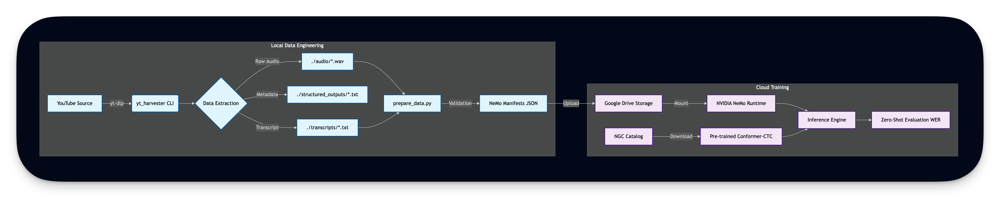

# Vietnamese ASR with NVIDIA NeMo

A local-to-Colab pipeline for collecting Vietnamese speech, validating the dataset, and training an ASR model.

  

The laptop handles YouTube collection, audio conversion, transcript selection, manifests, and tests.
Colab handles the GPU training work.

## Measured on a Colab T4

| Precision | Latency per file | VRAM | Result |
| --- | ---: | ---: | --- |
| float32 | 151 ms | about 731 MB | baseline |
| float16 | 89 ms | about 888 MB | about 40% faster |
| int8 | unavailable | about 166 MB | incompatible with this model type |

The benchmark uses `stt_en_conformer_ctc_large` and the validation manifest.
It measures this explicit Colab run, not Vietnamese recognition quality.

## Project boundary

- Prepare 16 kHz mono audio and Vietnamese transcripts
- Prefer manual subtitles, then fall back to automatic captions
- Split and validate NeMo manifests before a GPU run
- Benchmark an explicit model and precision on Colab
- Keep serving outside this repository

The checked-in zero-shot examples use an English Conformer on Vietnamese audio.
They prove that data reaches the model, not that the model understands Vietnamese.

[Setup, notebook workflow, evidence, tests, and limitations](GUIDE.md).

[Open the training notebook in Colab](https://colab.research.google.com/github/wheevu/nemo-vietnamese-asr/blob/main/NVIDIA_NeMo_ASR.ipynb).
